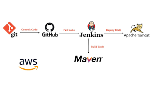

# The working of the SDLC pipeline
The working of this particular SDLC pipeline is simple, automated and easy to operate. It contains 3 servers(Development, Quality Assurance and Production server) on 3 instances on AWS EC2. Each instances has components and different uses. Development server contains Maven and Jenkins, Quality Assurance and Production server consists of Apache tomcat. In the beginning the Code is committed by the developer in the Github repository. That same Github repository with the help of GitSCM pulling triggers a proj. in the jenkins which compiles it into a .war file. In the same proj. as a post build option the .war file is sent into the tomcat of the QA server for testing the code. If the build is stable then the proj. sends it to another proj. in the jenkins which sends the tested and completed build to the tomcat in the Production server. That would be the final step which was the Deployment of the Java based application

First we need to install the required plugins in Jenkins to run this pipeline 
Go to Jenkins Manage > plugins > Available plugins and search the following plugins and install them. 

- Deploy to container

- Copy artifact

Now go to Jenkins dashboard create a new job. Name it testing and make it a freestyle project for simplicity.
 

Scroll down to the Source Code Management and select Git as the main source. Give this repository as the source 

*https://github.com/Sunloid/JenkinsPractice*

This the repository which the Developer has made as in this is the source code which contains the web application.
As this is just project is just to explain the repository contains only **Hello world!**.

Scroll down to the Build steps and select **Invoke top level maven targets** and in the goals section write **package**
 

In the Post build actions select **Deploy ear/war to a container**.
Fill the following as shown 

Add a container in the post build actions of the same and select tomcat9 if tomcat10 is not available 
For the credentianls select add and fill the username and password used for the login of tomcat10 in QA server. In my case its 
- username: sunloid
- password: admin

For tomcat URL use the private IP address of the QA server and the port no 8080 with it. For eg: 
http://(private IP of QA):8080

Add another post build action of **Archive the aritfacts** and write the name of the .war file to archive 

Now click on apply and save. 

Now go to the dashboard and create a new job with the name of Deployment and make it freestyle again. 

Under the Source Code Management select Git give this repository as the source. 
*https://github.com/Sunloid/test-repo2*
These are the test scripts. 

Under the Build Section use the **Copy artifacts from another projects** and mention the previous projects name which is **Testing**. 

Then under the post build actions select the **Deploy the .ear/.war to a container** option. 
Fill the sections as shown and for the tomcat URL use the pricate IP address of the Prod server with the port no. 8080. For eg: http://(Prod server Private IP):8080

This time for credentials use the username and password for the Prod server. In my case its: 
- username: sunloid
- password: admin

Then press apply and save. 

Go back to the Testing Project and scroll down to the post-build actions and select **Build other projects** options. In there write the name of the **Deploying** project.

As usual apply and save. 

The final step would be to build the Testing project and then go to the Prod server and under the application you will see the /Prodenv 

Click on the /Prodenv and if it displays **Hello, World!** then the Pipeline was a success. 