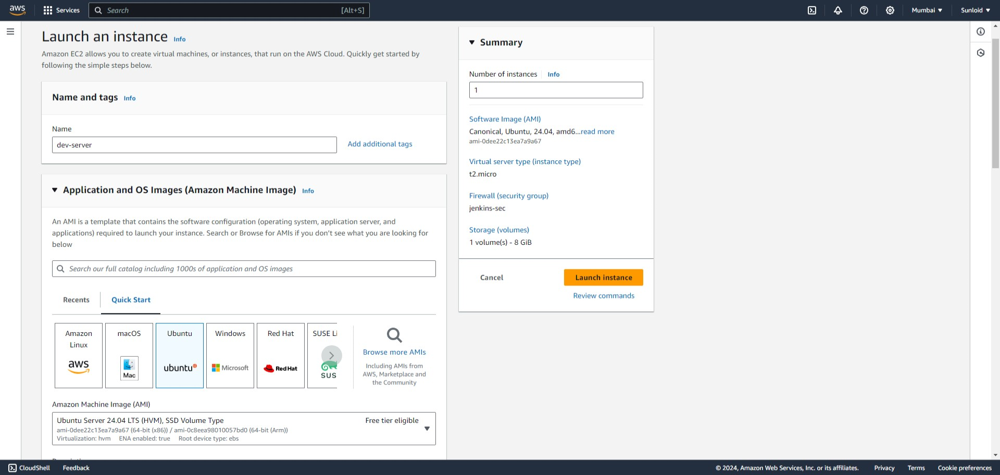

AWS EC2 (Amazon Elastic Compute Cloud) is a cloud computing service provided by Amazon Web Services (AWS) that allows users to rent virtual servers, known 
as instances, to run applications. EC2 enables scalable computing capacity in the cloud, meaning users can launch as many or as few virtual servers as 
needed, depending on demand.

SDLC Pipeline has 3 different server's which we will run on 3 different instances with different configuration and different setup for each. 

1. Development server (Dev): 
A development server in an SDLC pipeline is an environment where developers can build, test, and validate code before it moves to further stages, such as testing or production. It serves as a sandbox for writing and running code, ensuring that any new features, updates, or fixes function correctly in a controlled setting. Typically, the development server mimics the production environment but with more flexible configurations, allowing for debugging and experimentation. In a CI/CD pipeline, the development server is where initial builds occur, and unit tests are executed to catch errors early in the software lifecycle. 

Launch a instance with the name of dev-server

