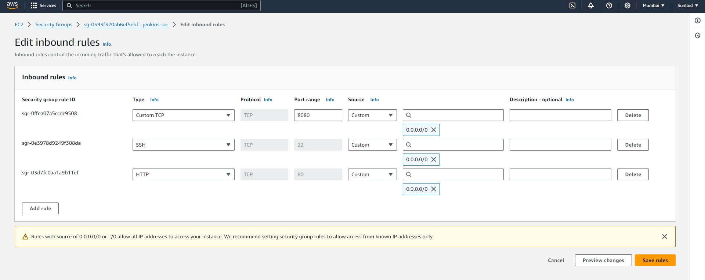

# Development Server: 
A development server in an SDLC pipeline is an environment where developers can build, test, and validate code before it moves to further stages, such as testing or production. It serves as a sandbox for writing and running code, ensuring that any new features, updates, or fixes function correctly in a controlled setting. Typically, the development server mimics the production environment but with more flexible configurations, allowing for debugging and experimentation. In a CI/CD pipeline, the development server is where initial builds occur, and unit tests are executed to catch errors early in the software lifecycle. The dev server will consists of the Jenkins, maven and Java.

## Setup:

Launch a instance with the name of dev-server with ubuntu linux and t2.micro.

Give the following inbound rules to its security group

Connect to the instance and run the following commands:

#!/bin/bash

sudo apt update

sudo apt install openjdk-11-jdk -y

sudo apt install maven -y

curl -fsSL https://pkg.jenkins.io/debian-stable/jenkins.io-2023.key | sudo tee \
  /usr/share/keyrings/jenkins-keyring.asc > /dev/null
  
echo deb [signed-by=/usr/share/keyrings/jenkins-keyring.asc] \
  https://pkg.jenkins.io/debian-stable binary/ | sudo tee \
  /etc/apt/sources.list.d/jenkins.list > /dev/null

sudo apt-get update

sudo apt-get install jenkins -y

systemctl start jenkins

These commmands install Maven, Java and Jenkins in the Dev server. The final command will start the jenkins. Now use the public IP of this instance on the port 8080. 
.png>)

The password asked above can be found on the bash itself or in the /root/.jenkins/secrets/initialAdminPassword .

After entering the password let jenkins download the suggested plugins. 

