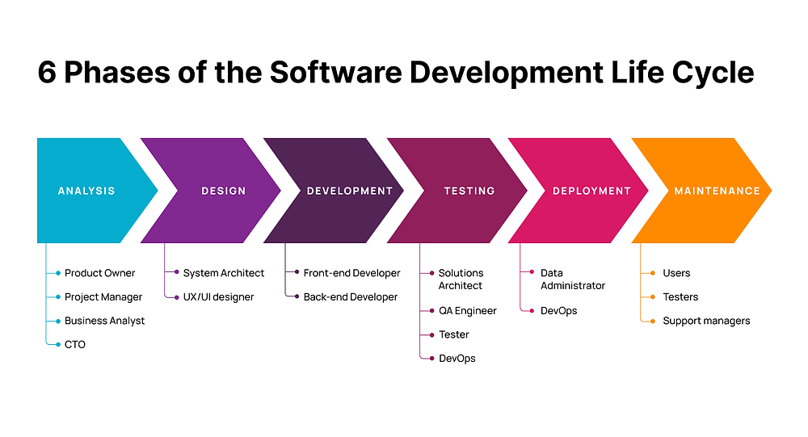

What is SDLC? 
SDLC (Software Development Life Cycle) is a structured process used to develop software efficiently and systematically. It outlines the steps involved in 
software creation, from planning and requirement gathering to design, development, testing, deployment, and maintenance. The main goal of SDLC is to 
ensure that high-quality software is delivered within defined timeframes and budgets.

In traditional SDLC models like Waterfall, each phase occurs sequentially. However, newer approaches, such as Agile, emphasize iterative development and 
constant feedback, which aligns well with DevOps practices.

SDLC and DevOps:
In DevOps, SDLC is enhanced through automation, continuous integration, and close collaboration between development and operations teams. DevOps 
integrates SDLC phases such as development, testing, and deployment into a continuous, streamlined process. This results in faster delivery, better 
quality, and quick feedback loops, with key practices like Continuous Integration/Continuous Deployment (CI/CD) playing a central role. DevOps essentially 
transforms SDLC into a more dynamic and collaborative framework for modern software development.

